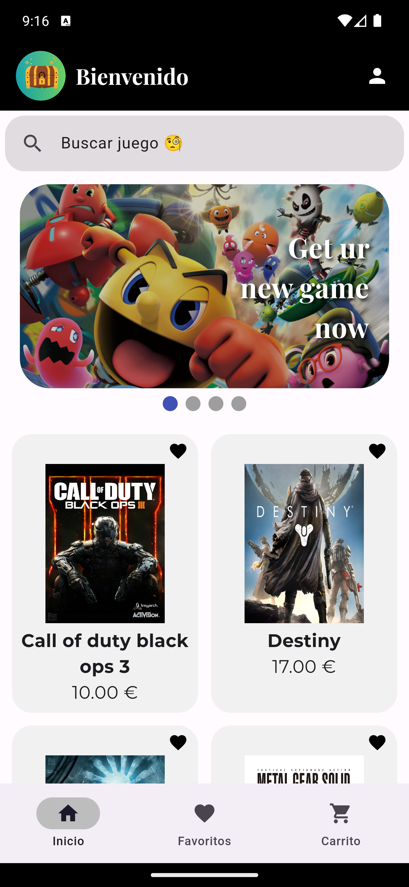
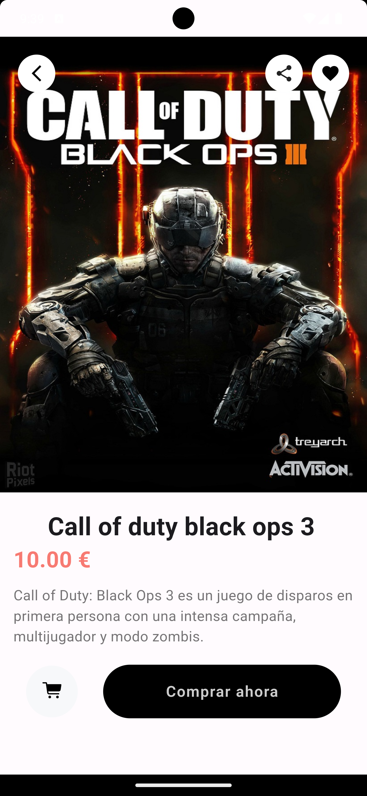
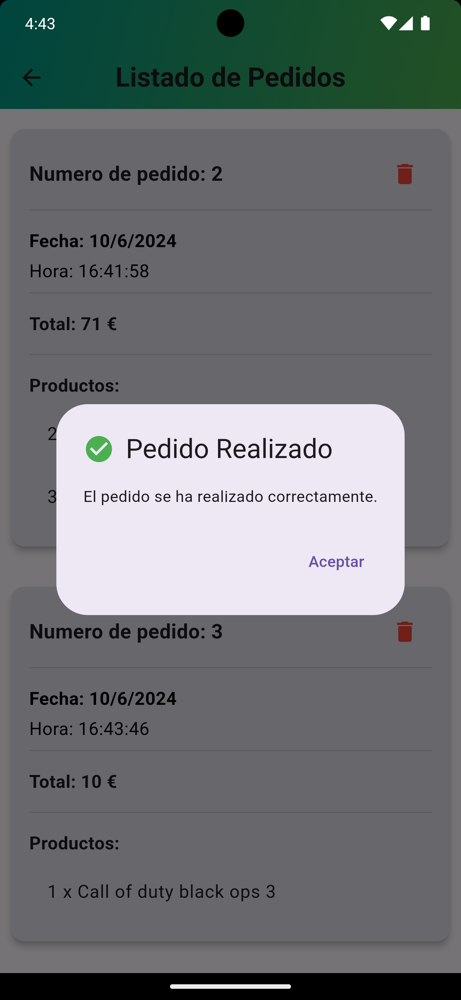

# 📱 Virtual Vault

Virtual Vault es una aplicación de Flutter diseñada para proporcionar una experiencia de compra en línea sencilla y efectiva. La aplicación permite a los usuarios explorar productos, gestionar favoritos, añadir artículos al carrito y realizar pedidos. Además, incluye funcionalidades de administración para gestionar productos y ver el historial de pedidos.

## 📂 Tabla de Contenidos

- [Características Principales](#características-principales)
- [Tecnologías Utilizadas](#tecnologías-utilizadas)
- [Instalación](#instalación)
- [Imágenes](#imágenes)

## 📋 Características Principales

- **Exploración de Productos:** Los usuarios pueden navegar y buscar entre una amplia gama de productos disponibles.
- **Autenticación de Usuarios:** Registro e inicio de sesión que permite a los usuarios acceder a sus favoritos, carrito de compras y realizar pedidos. Esta funcionalidad es crucial para personalizar la experiencia del usuario y gestionar sus interacciones con la aplicación.
- **Gestión de Favoritos:** Añadir y eliminar productos de la lista de favoritos para acceder fácilmente a los productos preferidos. Es necesario estar registrado y haber iniciado sesión para utilizar esta funcionalidad.
- **Carrito de Compras:** Añadir productos al carrito, modificar cantidades y eliminar artículos. El acceso al carrito también requiere que el usuario esté registrado y haya iniciado sesión.
- **Proceso de Compra:** Confirmar pedidos con un sistema de envío de correos electrónicos para la confirmación de la compra. La compra de productos solo está disponible para usuarios registrados y autenticados.
- **Funcionalidades de Administrador:** Gestionar productos, incluyendo la adición, modificación y eliminación, así como la visualización del historial de pedidos. Solo accesible para usuarios con privilegios de administrador.
- **Modo Oscuro:** Alternar entre modo claro y oscuro para una mejor experiencia de usuario.

## 🛠️ Tecnologías Utilizadas

- **Flutter:** Framework para el desarrollo de aplicaciones multiplataforma.
- **Dart:** Lenguaje de programación utilizado por Flutter.
- **Provider:** Para la gestión del estado en la aplicación.
- **SQLite:** Para la gestión local de bases de datos.
- **Google Fonts:** Para la personalización de fuentes en la aplicación.

## 🚀 Instalación

### Requisitos Previos

- Flutter instalado en tu máquina.
- Dart instalado.
- Un editor de código como Visual Studio Code o Android Studio.

### Pasos de Instalación

1. **Clonar el Repositorio**
   ```sh
   git clone https://github.com/tu-usuario/virtual-vault.git
   cd virtual-vault

## 🖼 Imágenes
- Pantalla principal
- Pantalla de producto
- Inicio de sesión
- Realización de pedido

      


